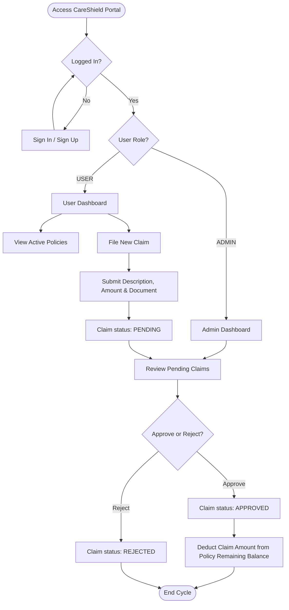
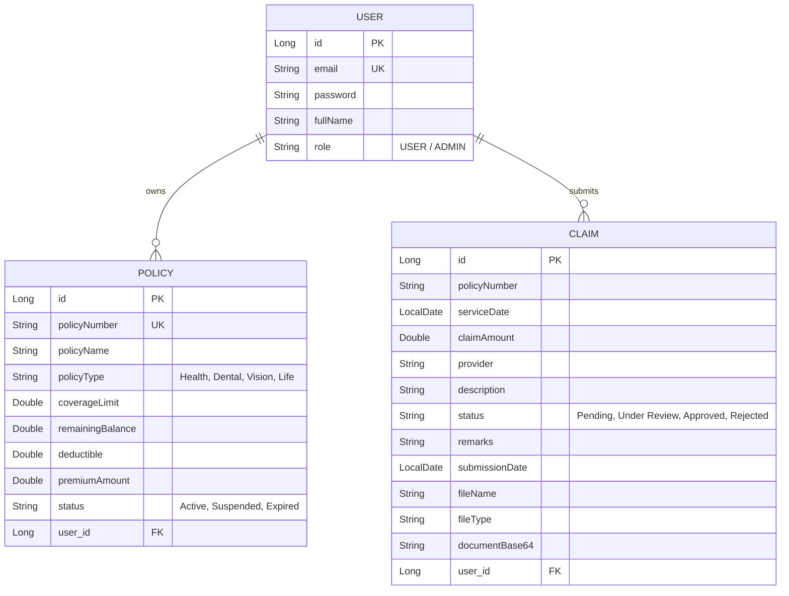

# CareShield - Digital Insurance Claims & Policies Portal

CareShield is a modern, web-based self-service insurance portal built with Spring Boot and JPA. It allows users to register, manage their insurance policies, file digital claims with uploaded documents, and track their reimbursement status. Admins can review, approve, or reject claims, which automatically updates the policy's remaining balance.

---

## 🚀 Getting Started

### Prerequisites
* **OS**: Windows
* **JDK**: Microsoft OpenJDK 17 (Automated in script)
* **Build Tool**: Maven 3.9.9 (Automated in script)

### Installation & Run
1. Run PowerShell as administrator and setup the compiler environment:
   ```powershell
   powershell -ExecutionPolicy Bypass -File .\setup_tools.ps1
   ```
2. Start the local server:
   ```powershell
   powershell -ExecutionPolicy Bypass -File .\run_app.ps1
   ```
3. Access the portal:
   * **URL**: [http://localhost:8080](http://localhost:8080)

---

## 📊 Flowchart

The following flowchart shows the user and admin interaction cycle in the CareShield portal.



---

## 🔄 Workflow

1. **User Onboarding**:
   * Users sign up via the Auth portal. The system assigns them the role of `USER` (or `ADMIN` depending on credentials).
   
2. **Dashboard Overview**:
   * **Users**: View active policies, coverages, remaining balance, and historical claims.
   * **Admins**: Monitor all users, active policies, and claim pending statistics.

3. **Claim Submission**:
   * The user selects an active policy and submits a claim specifying the provider, date of service, description, claim amount, and an attached receipt (Base64 encoded).

4. **Claims Processing**:
   * Admins evaluate claims.
   * **Approved**: The claim amount is deducted from the associated policy's `remainingBalance`.
   * **Rejected**: The status is updated with reviewer feedback remarks.

---

## 🗄️ Database ER Diagram

The database uses three principal entities: `User`, `Policy`, and `Claim`. Below is the entity-relationship model.



---

## 🛠️ Tech Stack
* **Backend**: Java 17, Spring Boot, Spring Data JPA, H2 Database (In-Memory)
* **Frontend**: Vanilla CSS, JavaScript (ES6+, Fetch API), Semantic HTML5
